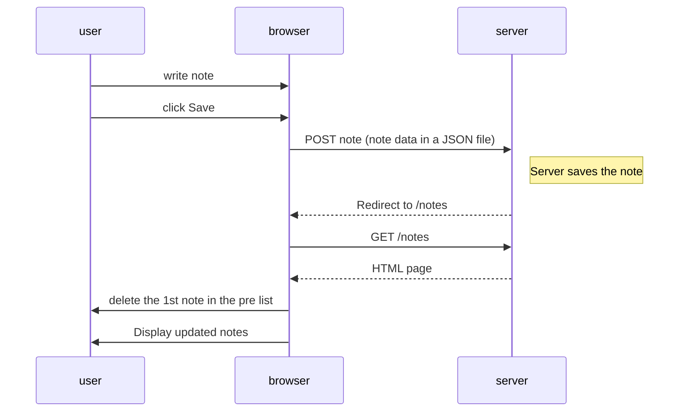

<!--
pre.notes
text field
submit button
-->

```mermaid
sequenceDiagram

    participant user
    participant browser
    participant server

    user->>browser: write note
    user->>browser: click Save

    browser->>server: POST note (note data in a JSON file)

    Note right of server: Server saves the note

    server-->>browser: Redirect to /notes

    browser->>server: GET /notes

    server-->>browser: HTML page

    browser->>user: delete the 1st note in the pre list
    browser->>user: Display updated notes
```