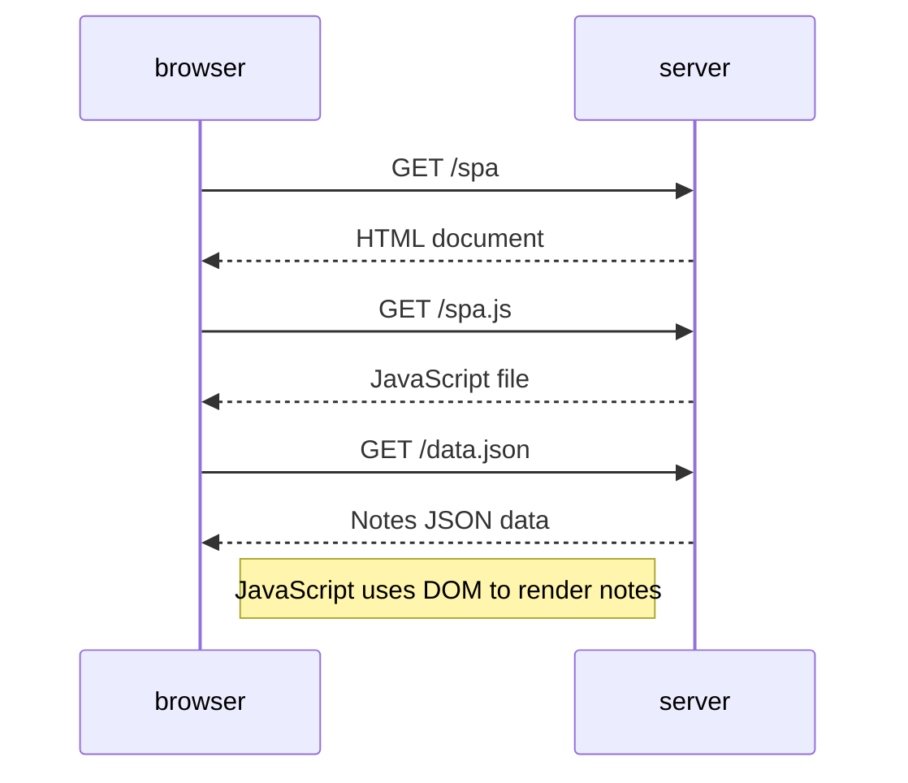

<!-- 
GET /spa
 ↓
Server
 ↓
HTML + JavaScript
 ↓
GET /data.json
 ↓
Render notes with JavaScript
-->

```mermaid
sequenceDiagram

    participant browser
    participant server

    browser->>server: GET /spa
    server-->>browser: HTML document

    browser->>server: GET /spa.js
    server-->>browser: JavaScript file

    browser->>server: GET /data.json
    server-->>browser: Notes JSON data

    Note right of browser: JavaScript uses DOM to render notes
```
