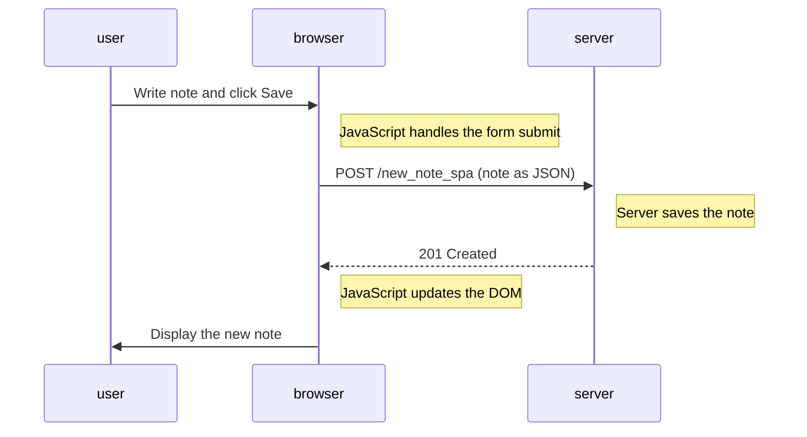

```mermaid
sequenceDiagram

    participant user
    participant browser
    participant server

    user->>browser: Write note and click Save

    Note right of browser: JavaScript handles the form submit

    browser->>server: POST /new_note_spa (note as JSON)

    Note right of server: Server saves the note

    server-->>browser: 201 Created

    Note right of browser: JavaScript updates the DOM

    browser->>user: Display the new note
```